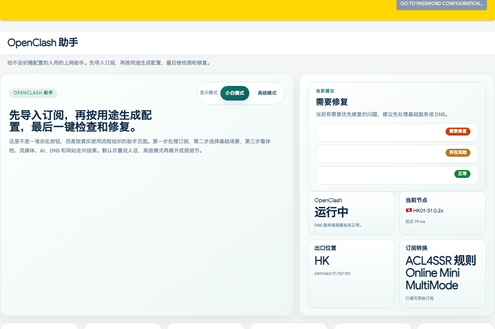

# OpenClash Assistant for OpenWrt

一个面向 iStoreOS / OpenWrt 的 LuCI 辅助插件，用来把 OpenClash 常见的软路由排障、访问检查、DNS 工具、自动切换和订阅转换能力整理成一个更直观的页面。

## 中文说明

- 中文使用说明：[`docs/中文说明.md`](docs/中文说明.md)
- GitHub Release 中文说明：[`docs/github-release-v0.1.1-zh.md`](docs/github-release-v0.1.1-zh.md)

## 一键安装命令

```sh
cd /tmp && curl -L -o openclash-assistant-istoreos-v0.1.1-r1.run https://github.com/Zhemuy-1a1a1/openclash-assistant-openwrt/releases/download/v0.1.1/openclash-assistant-istoreos-v0.1.1-r1.run && chmod +x openclash-assistant-istoreos-v0.1.1-r1.run && sh openclash-assistant-istoreos-v0.1.1-r1.run
```

## 项目简介

当前版本主要提供：

- `访问检查`
  统一检查流媒体与 AI 目标的连接状态、延迟和出口信息
- `分流测试`
  参考 `ip.skk.moe/split-tunnel` 思路做分流访问验证
- `DNS 工具`
  提供 `Flush DNS`
- `自动切换`
  辅助查看并应用 OpenClash 自动切换设置
- `订阅转换`
  内置 `sub-web-modify` 前端，并默认对接本机 `subconverter` 后端

页面入口：

`服务` -> `OpenClash Assistant`

## 界面截图

<p align="center">
  
  
</p>
<p align="center">
  
  
</p>

## 安装方式

- `ipk` 包：
  `dist/luci-app-openclash-assistant_0.1.1-1_all.ipk`
- `.run` 安装包：
  `dist/openclash-assistant-istoreos-v0.1.1-r1.run`

## 安装前检查

- `.run` 安装器会检查：
  - `uci`
  - LuCI 文件
  - `rpcd`
  - `uhttpd`
  - `opkg`
- `.run` 会自动尝试补装：
  - `bash`
  - `curl`
- `.run` 会提示但不强拦：
  - `OpenClash` 是否存在
  - `dnsmasq-full` 是否存在
- `.ipk` 会通过 `Depends` 声明依赖，并在安装后输出环境检查摘要

## English

A LuCI helper plugin for iStoreOS / OpenWrt that turns recurring OpenClash soft-router pain points into a compact diagnostic and access-check panel.

## Why this exists

Recent community reports repeatedly cluster around:

- Fake-IP compatibility in bypass-router deployments
- DNS hijack and upstream conflict diagnosis
- TUN / IPv6 / nftables dependency confusion
- Subscription and runtime state validation after updates
- Lack of a single, actionable "what should I choose" assistant for OpenClash modes

This project packages those needs into a lightweight LuCI plugin named `luci-app-openclash-assistant`.

## Current scope

- Runtime environment diagnostics for an OpenClash host
- Unified access checks for streaming and AI targets
- DNS utility panel with `Flush DNS`
- Node auto-switch guidance
- Built-in `sub-web-modify` frontend with subscription conversion helper
- LuCI page under `Services -> OpenClash Assistant`

## Project layout

- `docs/requirements-research.md` — demand collection and source summary
- `docs/mvp-design.md` — MVP goals and package architecture
- `luci-app-openclash-assistant/` — OpenWrt package scaffold

## Build / Install

- OpenWrt / iStoreOS package source: `luci-app-openclash-assistant/`
- One-file installer: `dist/openclash-assistant-istoreos-v0.1.1-r1.run`

## Install Checks

- `.run` installer:
  - checks for `uci`, LuCI files, `rpcd`, `uhttpd`
  - auto-installs `bash` and `curl` with `opkg` if missing
  - warns if `OpenClash` or `dnsmasq-full` are not installed
- `.ipk` package:
  - declares package dependencies through `Depends`
  - prints a short post-install environment check summary

## Open Source References

This project references or draws inspiration from the following open source projects:

- [vernesong/OpenClash](https://github.com/vernesong/OpenClash)
  Core product context, OpenClash runtime behavior, and LuCI/OpenWrt integration assumptions.
- [openwrt/luci](https://github.com/openwrt/luci)
  LuCI package structure, menu/ACL wiring, and frontend conventions.
- [Rabbit-Spec/Surge](https://github.com/Rabbit-Spec/Surge)
  Panel interaction ideas and visual inspiration, especially:
  - `Module/Panel/Stream-All`
  - `Module/Panel/Flush-DNS`
- [ACL4SSR/ACL4SSR](https://github.com/ACL4SSR/ACL4SSR)
  Subscription conversion template references.
- [Aethersailor/Custom_OpenClash_Rules](https://github.com/Aethersailor/Custom_OpenClash_Rules)
  Additional subscription conversion template references.
- [youshandefeiyang/sub-web-modify](https://github.com/youshandefeiyang/sub-web-modify)
  Built-in subscription conversion frontend embedded under LuCI static assets.

These upstream projects remain owned by their respective authors. This repository does not claim ownership of those projects and only reuses ideas, integration knowledge, or template references where applicable.

## Notes

This repository is designed to be built inside an OpenWrt tree / SDK, or installed on compatible iStoreOS / OpenWrt systems via the generated `.run` installer.
